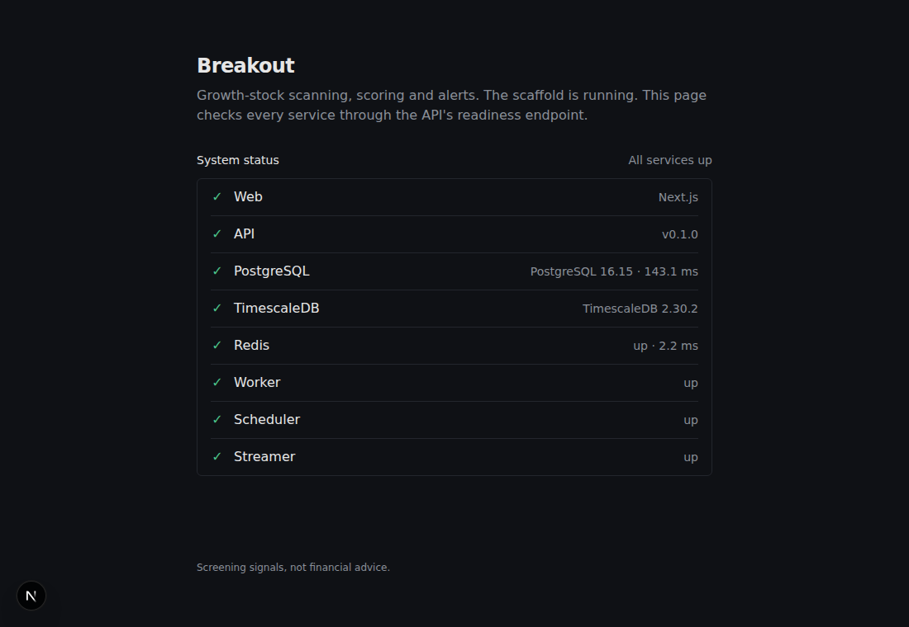

# Breakout

A fast, explainable growth-stock scanner. It searches and analyses any US stock, scans the whole
market for breakout setups using a CAN SLIM / Trend Template / VCP methodology, plans each trade
(entry, stop, size, targets) and alerts you when a setup triggers.

> Outputs are screening signals, not financial advice. The platform never places trades.

The full product and build specification is in [`docs/spec.md`](docs/spec.md).

## Quick start

Requirements: Docker (with Compose v2) and `make`.

```bash
cp .env.example .env      # optional in development: every key has a keyless default
make dev                  # builds and starts all services, waits until healthy
```

- Web: <http://localhost:3000> (the home page shows the health of every service)
- API docs: <http://localhost:8000/api/docs>

`make help` lists every command. `make test` and `make lint` run all checks inside the
containers.

## Services

| Service | Role |
|---|---|
| `web` | Next.js app. Proxies `/api/*` to the API so secrets stay server-side |
| `api` | FastAPI: REST + (later) WebSocket |
| `worker` | arq background jobs: scans, backfills, fundamentals |
| `scheduler` | APScheduler: runs the market-hours schedule in US/Eastern |
| `streamer` | Live market data feed (Phase 6) |
| `postgres` | PostgreSQL 16 + TimescaleDB |
| `redis` | Cache, pub/sub and job queue |

## Status

| Phase | | |
|---|---|---|
| 0 | Scaffold | ✅ done |
| 1 | Data foundation | next |
| 2–8 | Indicators → patterns → scoring → UI → real-time → backtests → polish | planned |


