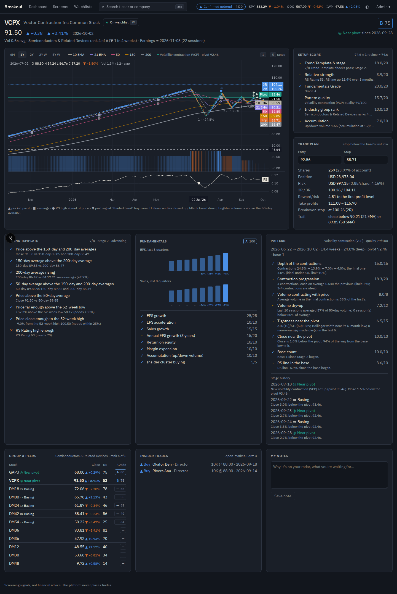
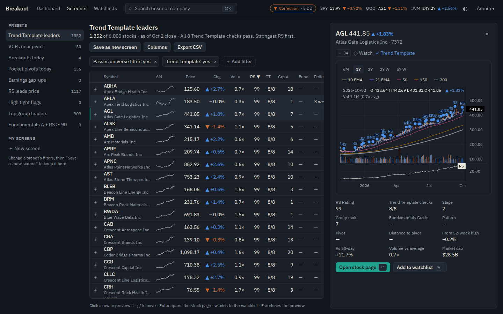

# Breakout

A fast, explainable growth-stock scanner. It searches and analyses any US stock, scans the whole
market for breakout setups using a CAN SLIM / Trend Template / VCP methodology, plans each trade
(entry, stop, size, targets) and alerts you when a setup triggers.

> Outputs are screening signals, not financial advice. The platform never places trades.

The full product and build specification is in [`docs/spec.md`](docs/spec.md).

## Quick start

Requirements: Docker (with Compose v2) and `make`.

```bash
cp .env.example .env                       # then set SEC_USER_AGENT="Breakout you@example.com"
make dev                                   # builds and starts all services, waits until healthy
make seed                                  # default settings ($100k account, 1% risk, spec §14)
make create-user email=you@example.com     # your login (prompts for a password)
```

- Web: <http://localhost:3000>. Sign in, then open **Admin → Data** to watch the universe and
  backfill. Once prices and the evening scan are in, the dashboard, screener, stock pages and
  watchlists fill in. Press ⌘K (or `/`) anywhere to search.
- API docs: <http://localhost:8000/api/docs>

On first start the scheduler builds the universe (~5,000 US stocks and ADRs) and backfills 10
years of daily bars. With the free development sources that takes roughly 30–60 minutes; it is
resumable (`make backfill`). After that, prices update automatically 20 minutes after each
close, followed by analytics, Fundamentals Grades, pattern detection, setup scores and their
lifecycle (watch → basing → near pivot → breakout → extended / failed), trade plans and the
signal log, whose outcomes are tracked for 60 sessions. Fundamentals (statements, earnings
dates, insider trades) load nightly from SEC EDGAR; run `make fundamentals full=1` once after
the first backfill to load them straight away.

No API keys are needed for development: the universe comes from the Nasdaq Trader symbol
directory, company data from SEC EDGAR, and prices from yfinance (development only; switch
`PRICE_PROVIDER` to a paid feed before relying on it).

`make help` lists every command. `make test` and `make lint` run all checks inside the
containers; `make e2e` runs the Playwright journeys (natively; see the Makefile).

## Services

| Service | Role |
|---|---|
| `web` | Next.js app. Proxies `/api/*` to the API so secrets stay server-side |
| `api` | FastAPI: REST + (later) WebSocket |
| `worker` | arq background jobs: scans, backfills, fundamentals |
| `scheduler` | APScheduler: runs the market-hours schedule in US/Eastern |
| `streamer` | Live market data feed (Phase 6) |
| `postgres` | PostgreSQL 16 + TimescaleDB |
| `redis` | Cache, pub/sub and job queue |

## Status

| Phase | | |
|---|---|---|
| 0 | Scaffold | ✅ done |
| 1 | Data foundation | ✅ built (live acceptance pending data access) |
| 2 | Indicators, regime, RS, groups | ✅ built (live acceptance pending data access) |
| 3 | Fundamentals & patterns | ✅ built (live acceptance pending data access) |
| 4 | Scoring, lifecycle, trade plans, scanner | ✅ built (live acceptance pending data access) |
| 5 | Core UI | ✅ built (awaiting approval) |
| 6–8 | Real-time → backtests → polish | planned |



_The stock page: the chart is the hero, with the detected base drawn on it (outline, numbered
contractions and their depth, buy-zone band, pivot, stop, 2R/3R), the moving averages, volume,
the RS line and markers for pocket pivots, earnings, RS highs and past signals. Around it: the
Setup Score part by part, a trade plan that resizes as you edit the entry or stop, the Trend
Template with the actual numbers, fundamentals, the pattern's scoring, group peers, insider
buying and your notes. Keys: `1`–`5` change the range, `w` adds to the watchlist, `[` / `]`
flip through the list you came from. [Light theme](docs/screenshots/phase5-stock-light.png)._



_The screener on a 6,000-stock synthetic market: nine presets (Trend Template leaders, VCPs
near pivot, breakouts and pocket pivots today, earnings gap-ups, RS leads price, high tight
flags, top group leaders, fundamentals A + RS ≥ 90), filters on any computed field, saved
screens, column chooser, CSV export and a side-panel chart preview. Also: the
[dashboard](docs/screenshots/phase5-dashboard.png) (regime with its reasons and breadth, top
setups, names about to break out, recent breakouts and how they're doing, leading groups,
sector rotation, signals) and [watchlists](docs/screenshots/phase5-watchlists.png) (several
lists, drag to reorder, a note per stock, flip-through). Phones get a bottom tab bar._

**Phase 5 performance** (spec §10; production build, 6,000 stocks, single API worker):

| Target | Measured |
|---|---|
| Ticker search < 100 ms p95 (server) | 52 ms p95 over 1,000 mixed queries (symbols, names, typos) |
| Stock page first meaningful paint < 1 s | content at ~110 ms; chart drawn at ~640 ms (median of 12) |
| Screener: 6,000 rows at 60 fps | 60 fps scrolling 6,000 rows (no frame over 20 ms); sort ≈ 0.2 s |
| Lighthouse performance ≥ 90 on the dashboard | 95 mobile / 100 desktop (accessibility 100) |

Earlier phases: [setups](docs/screenshots/phase4-setups.png),
[signal log](docs/screenshots/phase4-signals.png), [pattern review](docs/screenshots/phase3-patterns.png),
[inspection](docs/screenshots/phase3-inspect.png), [data](docs/screenshots/phase1-data.png)
(under **Admin**).
