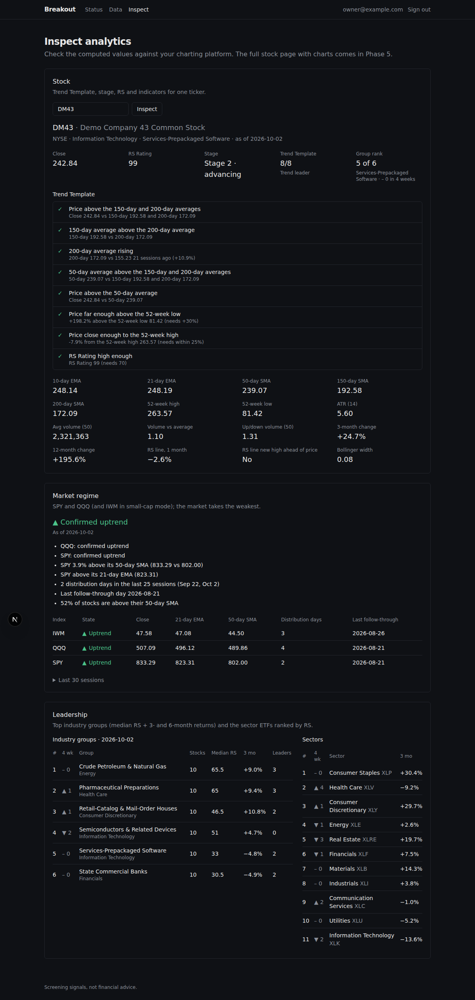

# Breakout

A fast, explainable growth-stock scanner. It searches and analyses any US stock, scans the whole
market for breakout setups using a CAN SLIM / Trend Template / VCP methodology, plans each trade
(entry, stop, size, targets) and alerts you when a setup triggers.

> Outputs are screening signals, not financial advice. The platform never places trades.

The full product and build specification is in [`docs/spec.md`](docs/spec.md).

## Quick start

Requirements: Docker (with Compose v2) and `make`.

```bash
cp .env.example .env                       # then set SEC_USER_AGENT="Breakout you@example.com"
make dev                                   # builds and starts all services, waits until healthy
make seed                                  # default settings ($100k account, 1% risk, spec §14)
make create-user email=you@example.com     # your login (prompts for a password)
```

- Web: <http://localhost:3000>. Sign in, then open **Data** to watch the universe and backfill.
- API docs: <http://localhost:8000/api/docs>

On first start the scheduler builds the universe (~5,000 US stocks and ADRs) and backfills 10
years of daily bars. With the free development sources that takes roughly 30–60 minutes; it is
resumable (`make backfill`). After that, prices update automatically 20 minutes after each
close. No API keys are needed for development: the universe comes from the Nasdaq Trader symbol
directory, company data from SEC EDGAR, and prices from yfinance (development only; switch
`PRICE_PROVIDER` to a paid feed before relying on it).

`make help` lists every command. `make test` and `make lint` run all checks inside the
containers.

## Services

| Service | Role |
|---|---|
| `web` | Next.js app. Proxies `/api/*` to the API so secrets stay server-side |
| `api` | FastAPI: REST + (later) WebSocket |
| `worker` | arq background jobs: scans, backfills, fundamentals |
| `scheduler` | APScheduler: runs the market-hours schedule in US/Eastern |
| `streamer` | Live market data feed (Phase 6) |
| `postgres` | PostgreSQL 16 + TimescaleDB |
| `redis` | Cache, pub/sub and job queue |

## Status

| Phase | | |
|---|---|---|
| 0 | Scaffold | ✅ done |
| 1 | Data foundation | ✅ built (live acceptance pending data access) |
| 2 | Indicators, regime, RS, groups | ✅ built, in review |
| 3 | Fundamentals & patterns | next |
| 4–8 | Scoring → UI → real-time → backtests → polish | planned |



_The analytics inspection page (Trend Template checklist, market regime with reasons, group and
sector leadership), shown with a synthetic demo market. The [data page](docs/screenshots/phase1-data.png)
covers the universe, backfill and data health._
